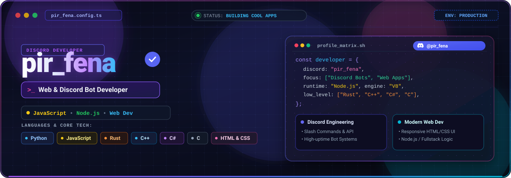
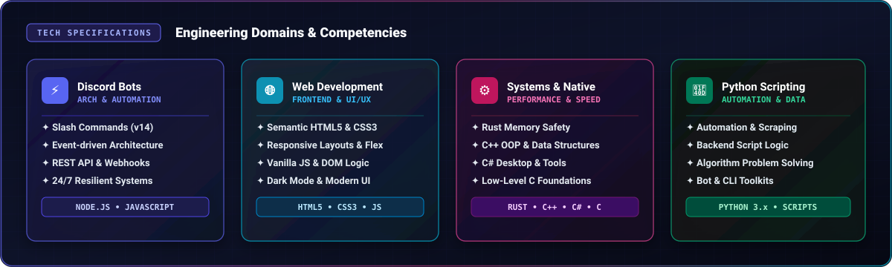

  

    

  <!-- Top Badges -->
  
  
  

   

  
  
  

---

 

---

  

 

---

  ### 📊 GitHub Activity & Analytics

  
  

    

  

---

  **Discord:** `pir_fena` &nbsp;•&nbsp; **Focus:** `Web & Discord Bot Developer` &nbsp;•&nbsp; **Tech:** `JavaScript • Node.js • Web Dev`

  Engineered by **pir_fena**

